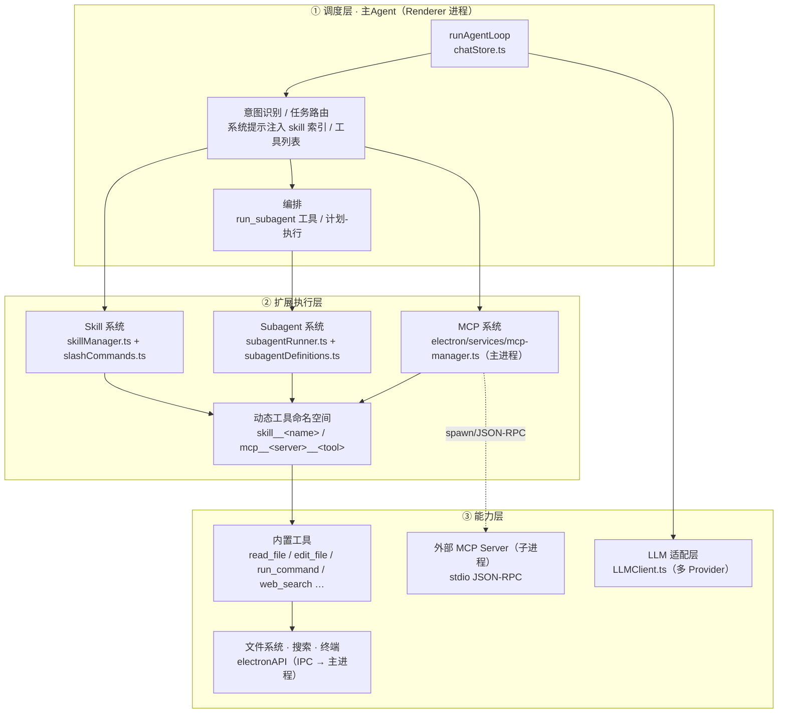
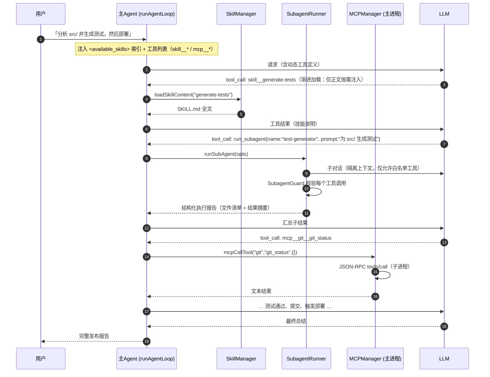
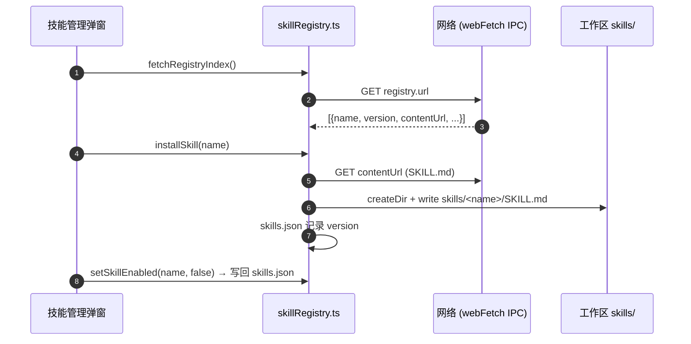
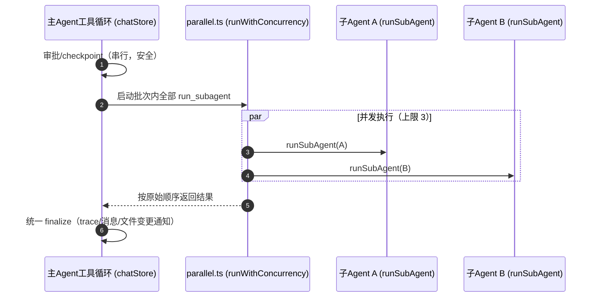
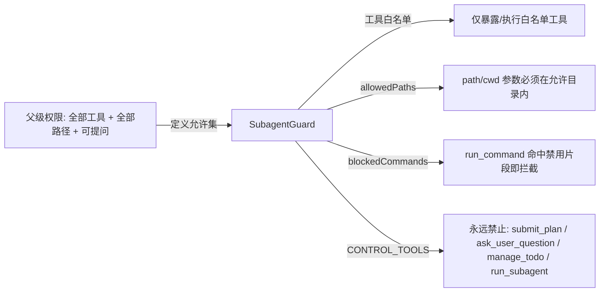
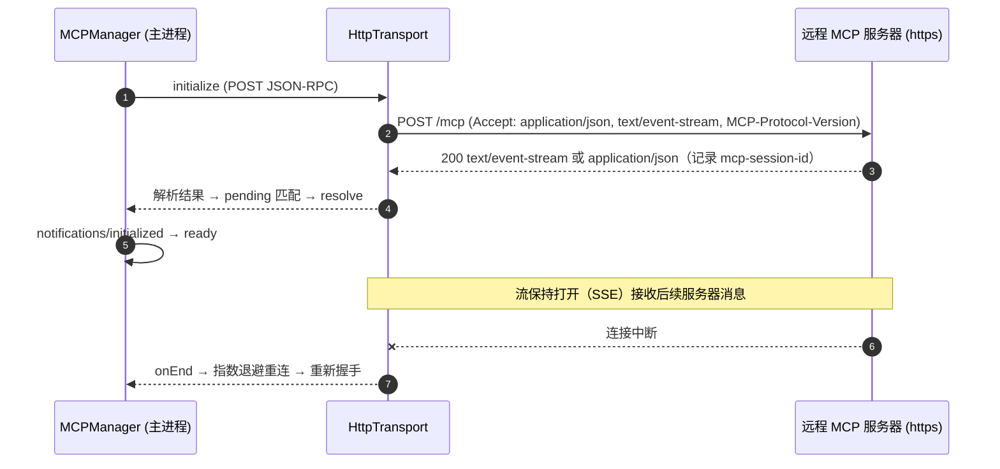
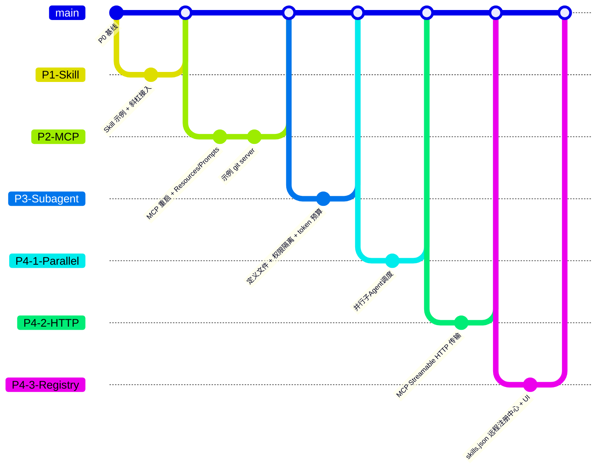

# OurCode IDE 扩展架构设计文档（Skill / Subagent / MCP）

> 版本：0.1 ｜ 技术栈：**Electron + React + TypeScript（electron-vite）+ Vitest** ｜ 状态：已落地（本仓库代码即实现）

本文档按「任务规格」顺序组织：① 总体架构 → ② 核心模块详细设计 → ③ 关键代码实现 → ④ 配置与目录结构 → ⑤ 安全与性能 → ⑥ 实施路线图。所有引用均可对应到本仓库的实际代码。

---

## 1. 总体架构

### 1.1 三层架构



**职责划分**

| 层 | 模块 | 职责 |
| --- | --- | --- |
| ① 调度层 | `runAgentLoop`（chatStore.ts:1309） | 主循环：构建系统提示 → 注入动态工具 → 流式调用 LLM → 审批 → 执行工具 → 汇总；维护会话、计划模式、checkpoint |
| ② 扩展执行层 | Skill | 发现 `SKILL.md`、解析前matter、生成 `skill__<name>` 动态工具、索引注入 |
| ② | Subagent | 定义加载、权限守卫（`SubagentGuard`）、串行执行嵌套任务、结果回收 |
| ② | MCP | 主进程内 stdio JSON-RPC 客户端：握手、tools/resources/prompts、超时/重启 |
| ③ 能力层 | 内置工具 / IPC / LLM | 文件读写、搜索、命令、网络、多 Provider 推理 |

### 1.2 端到端交互流程（用户输入 → 汇总结果）

以「自动分析代码并生成测试，然后部署」为例：



### 1.3 数据流与上下文管理策略

| 维度 | 策略 | 实现 |
| --- | --- | --- |
| **渐进加载** | 系统提示只注入「索引」（技能名+一句话描述）；全文在模型实际调用 `skill__<name>` 时才注入 | `buildSkillIndex`（skillManager.ts:162）→ `<available_skills>`；`loadSkillContent`（:170） |
| **子Agent上下文隔离** | 子Agent拥有**全新上下文窗口**（system + task），不继承父对话历史；只注入环境、当前打开文件（截断 200 行）、技能索引 | `buildSubSystemPrompt`（subagentRunner.ts:48） |
| **工具描述去重** | MCP 工具描述在每次 run 前刷新一次（`refreshMcpTools`），不重复累积 | ToolExecutor.ts:36 |
| **主对话上下文裁剪** | 超预算时裁剪最旧历史 | `trimHistoryForContext`（chatStore.ts:1358） |
| **结果回收** | 子Agent返回固定格式 Markdown 报告（背景/工具调用/涉及文件/结果），由主Agent作为普通工具结果继续推理 | subagentRunner.ts:211 |
| **用量审计** | skill/subagent/mcp 均写入 usage dashboard（category 分别为 `skill`/`subagent`/`mcp`） | ToolExecutor.ts:72 |

---

## 2. 核心模块详细设计

### a. Skill 系统

#### 定义格式（`SKILL.md`，Claude Code 风格）

每个技能是**一个目录 + 一个 `SKILL.md`**（目录名作 fallback 名称）。前matter 只需 `name` / `description`（用于索引），正文为步骤化指令：

````markdown
---
name: generate-tests
description: 为目标代码模块生成单元测试，运行测试并迭代修复直到通过
---

# 生成单元测试（generate-tests）

## 执行步骤
1. 分析源码：读取目标文件与依赖，识别公开签名/边界/错误分支…
2. 确定测试位置与命名：遵循项目现有约定…
3. 编写测试：正常路径 + 边界 + 错误分支 + mock 外部依赖…
4. 运行测试：run_command 执行项目测试命令…
5. 迭代修复：区分「测试写错」与「源码 bug」…
````

解析器：`parseSkillFrontmatter`（skillManager.ts:76）宽容处理缺失前matter（目录名作名称、首行正文作描述）。

#### 发现与加载

- **扫描目录**：工作区 `.claude/skills`、`.ourcode/skills`、`skills`，以及全局 `<userData>/skills`（skillManager.ts:24）。
- **缓存**：按全部技能文件的最新 mtime 失效（:108），避免每次请求都重扫磁盘。
- **远程注册中心**：通过 `skills.json` 配置 `registry.url` 拉取远程技能索引并安装到 `skills/`（见下文「远程注册中心」），安装后由本地发现机制自动接入。

#### 触发方式（双通道）

1. **斜杠命令**：`/` 菜单 = 静态模板 + 扫描到的技能动态合并。`getAllSlashCommands()`（slashCommands.ts）为每个技能生成 `/技能名` 命令，模板引导模型「先调 `skill__<name>` 再执行」。技能命令与静态模板共用 `buildSlashPrompt` 的 `{{selection}}/{{language}}/{{file}}` 占位符。
2. **AI 自动匹配**：系统提示含 `<available_skills>` 索引，模型可自行决定调用 `skill__<name>`。

#### 示例技能（本仓库 `skills/`）

| 技能 | 说明 | 涉及扩展 |
| --- | --- | --- |
| `code-review` | 结构化代码审查：范围收集 → 分面检查（正确性/健壮性/安全/性能/可维护性）→ 分级报告 | Skill + Subagent(`code-reviewer`) |
| `generate-tests` | 分析源码 → 写测试 → 运行 → 迭代修复 | Skill + Subagent(`test-generator`) |
| `deploy` | 「测试 → 构建 → 提交 → 部署」端到端发布流程 | Skill + Subagent + **MCP git 服务器** |

#### 远程注册中心（skills.json）

`<root>/skills.json` 是技能的标准配置/注册表（`src/services/skills/skillRegistry.ts`）：

```jsonc
{
  "registry": { "url": "https://example.com/registry/index.json" },  // 远程索引
  "skills": { "deploy": { "enabled": false, "version": "1.2.0" } }   // 启用覆盖 + 已装版本
}
```



- **启用过滤**：`skillManager.listSkills` 按 `isSkillEnabled` 过滤禁用技能（索引/动态工具/`/`菜单同步生效）；`includeDisabled=true` 供 UI 展示全部。
- **安装即用**：拉取 SKILL.md 写入 `skills/<name>/` 后即被本地发现机制自动接入。
- **版本管理**：`compareRegistryEntry` 对比本地 `skills.json` 记录的 version 与远端索引 → 安装 / 更新 / 已装。
- **UI**：`SkillRegistryModal`（命令面板 `openSkillRegistry` 打开）—「本地技能」标签页启用/卸载，「注册中心」标签页浏览/安装/更新。
- **边界**：经 `webFetch` 拉取（无自定义请求头），适用于公开索引；鉴权列为后续。

### b. Subagent 系统

#### 定义方式（Markdown + 前matter）

`.ourcode/agents/<name>.md`（工作区）或 `<userData>/agents/<name>.md`（全局），找不到时回退到 `BUILTIN_AGENTS`（subagentDefinitions.ts）。前matter 字段即「配置」：

```yaml
---
name: test-generator            # 名称（run_subagent 的 name 参数）
description: 单元测试生成器
tools: [read_file, …run_command]   # 工具白名单（缺省 = 继承父级全部）
allowedPaths: [src, tests, .]      # 路径范围（相对项目根解析）
blockedCommands: [rm -rf]          # run_command 禁用片段
maxIterations: 12                  # 迭代轮数预算
maxTokensBudget: 150000            # token 预算（prompt+completion）
temperature: 0.1
---
（正文 = 该子智能体的 system prompt）
```

#### 调度机制（串行 + 并行）

- **何时**：主Agent在工具调用阶段自主决定（`run_subagent` 工具，需审批，ToolRegistry.ts:248）。
- **如何（串行）**：`runSubAgent()`（subagentRunner.ts:83）在父的工具调用栈内**同步阻塞串行**执行：
  1. 按 name 加载定义 + 构建 `SubagentGuard`；
  2. 构建隔离系统提示（定义正文 + 环境 + 当前文件 + 技能索引 + 规则）；
  3. 循环：LLM 请求（仅暴露白名单工具）→ 执行工具（守卫校验）→ 写操作前 checkpoint；
  4. 到达迭代/token 预算或模型不再调用工具时结束。
- **并行调度**：同一 LLM 批次中的多个 `run_subagent` 调用**自动并发执行**（上限 3，`MAX_PARALLEL_SUBAGENTS`）。每个子Agent本就完全隔离（各自 executor/guard/消息数组/预算/用量上报），天然可并发：



  实现要点（`src/services/subagents/parallel.ts` + chatStore.ts:1549 工具循环改造）：
  - `runWithConcurrency(tasks, limit)` — 信号量式并发，结果**按输入顺序**排列；单个失败不牵连其他。
  - 审批、checkpoint、trace 保持串行；仅 `toolExecutor.execute` 并发化。
  - 结果按原始顺序回填；所有适配器均按 `tool_call_id` 匹配工具结果，批次内消息顺序无关（已验证 Gemini 亦按 id 匹配）。
  - 每个子Agent仍受自己的 `SubagentGuard` 约束，权限单调衰减不变。

#### 结果回收格式

```markdown
## 子智能体「test-generator」执行报告
**工具调用**: 12 次 · **修改文件**: 3 个 · **消耗 token**: 48210
**涉及文件**:
- src/utils/format.ts
**结果**:
（子Agent 的结构化总结）
```

主Agent将该报告作为普通工具结果继续推理并融入最终回复。

#### 权限隔离（单调衰减）



两层防御：① 工具**可见性**过滤（`getToolDefinitions(filter)`，LLM 根本看不到白名单外的工具）；② 执行前**运行时校验**（`guard.checkCall`）。子Agent永远不能派生孙Agent或向用户提问，保证委托树有界。

### c. MCP 集成

#### Client–Server 架构

- **Client**：IDE 主进程内的 `MCPManager`（electron/services/mcp-manager.ts），Electron renderer 通过 preload 暴露的 IPC 调用。
- **Server**：独立进程，stdio 传输，JSON-RPC 2.0（newline-delimited JSON；兼容 LSP `Content-Length` 帧）。支持 Tools / Resources / Prompts 三类能力。

#### Streamable HTTP 传输（SSE）

stdio 之外，`MCPManager` 抽象出统一 `McpTransport` 接口（`send/onMessage/onLog/onEnd/close`），新增 `HttpTransport` 实现 MCP 官方 **Streamable HTTP（2025-03-26）**：



- 每个请求独立 POST；响应为 `application/json` 或 `text/event-stream`（手写 SSE 解析，`data:` 负载按 id 匹配 pending）。
- `mcp-session-id` 响应头被捕获并在后续请求回传；`headers` 配置项支持自定义（如 Authorization）。
- **重连语义**：优雅的流关闭（服务器发送完毕后结束）**不**触发重连（Streamable HTTP 按请求开新流）；连接异常中断（ECONNRESET 等）才触发退避重连 + 重新握手。
- `mcp_config.json` 中配置 `serverUrl`（或 `url`）即可使用远程传输；仅允许 http/https。

#### 动态加载

1. 打开工作区 → `mcp.loadConfig(rootPath)`（main.ts:316）：读取 `<root>/mcp_config.json`（或 `.mcp.json`）。
2. 每个 server 以数组参数 spawn（不经 shell，`cwd=rootPath`），自动完成 `initialize` 握手 + `notifications/initialized`。
3. `tools/list` → 渲染进程 `refreshMcpTools()` → 合并为 `mcp__<server>__<tool>` 动态工具定义。
4. 服务器进程崩溃 → 指数退避自动重启（1s→2s→4s…，最多 5 次），重新握手，`ready`（`restarted=true`）事件上报 dashboard。
5. `stopAll()` 置 `intentionalStop`，不会产生僵尸重启。

#### Tools / Resources / Prompts 映射为 IDE 资源

| MCP 能力 | 协议方法 | IDE 映射 | 触发时机 |
| --- | --- | --- | --- |
| Tools | `tools/list` → `tools/call` | `mcp__<server>__<tool>` 动态工具（OpenAI function-calling 格式） | 每次 run 前刷新 |
| Resources | `resources/list` → `resources/read` | `mcpListResources` / `mcpReadResource` IPC（按需注入上下文，同技能策略） | 按需 |
| Prompts | `prompts/list` → `prompts/get` | `mcpListPrompts` / `mcpGetPrompt` IPC（可复用提示模板，如提交信息生成） | 按需 |

#### 集成示例：Git MCP Server（`mcp-servers/git-server/server.js`）

零依赖 Node stdio 服务器，包装 `git` CLI：工具 `git_status/git_log/git_diff/git_branch/git_commit/git_push`；资源 `git://branch`、`git://status`；提示词 `commit-message`。配置方式见 `mcp_config.example.json`。

---

## 3. 关键代码实现

> 以下为核心接口定义（TypeScript），与本仓库实现一一对应。

### 3.1 SkillManager

实际实现为函数式模块 `src/services/skills/skillManager.ts`（Electron renderer 场景无状态单例更省事），类视图如下：

```ts
interface SkillInfo {
  name: string
  description: string
  source: 'workspace' | 'global'
  path: string
  content: string   // SKILL.md 全文（仅在调用 skill__<name> 时返回）
  mtime: number
}

class SkillManager {
  async listSkills(force?: boolean, rootOverride?: string): Promise<SkillInfo[]>
  // 扫描 .claude/skills、.ourcode/skills、skills + 全局 userData/skills，mtime 缓存

  parseSkillFrontmatter(content: string, fallbackName: string): { name: string; description: string; body: string }

  buildSkillIndex(rootOverride?: string): Promise<string>
  // → "<available_skills>- code-review: …</available_skills>"（只含索引，渐进加载）

  loadSkillContent(name: string, rootOverride?: string): Promise<string | null>
  // 技能正文（供 skill__<name> 工具返回）

  toSkillToolDefinitions(force?: boolean, rootOverride?: string): Promise<ToolDefinition[]>
  // 动态工具：skill__<name> → OpenAI function 定义
}

// 斜杠命令桥接（slashCommands.ts）
async function getSkillSlashCommands(rootOverride?: string): Promise<SlashCommand[]>
async function getAllSlashCommands(rootOverride?: string): Promise<SlashCommand[]>

// 远程注册中心（skillRegistry.ts）
interface RegistrySkillInfo { name: string; description?: string; version?: string; author?: string; contentUrl?: string }

class SkillRegistry {
  async readSkillConfig(root: string): Promise<{ registryUrl?: string; skills: Record<string, { enabled?: boolean; version?: string }> }>
  async isSkillEnabled(name: string, root: string): Promise<boolean>       // 默认启用
  async setSkillEnabled(name: string, enabled: boolean, root: string): Promise<boolean>
  async fetchRegistryIndex(url?: string, root?: string): Promise<RegistrySkillInfo[]>  // webFetch IPC
  async installSkill(name: string, root: string, entry?: RegistrySkillInfo): Promise<string | null> // → 写入 skills/<name>/SKILL.md
  async uninstallSkill(name: string, root: string): Promise<boolean>
  compareRegistryEntry(local, remote): 'install' | 'update' | 'installed'
}
```

### 3.2 SubagentManager

```ts
interface SubAgentDefinition {
  name: string
  description: string
  systemPrompt: string
  tools?: string[]            // 白名单；缺省 = 全部
  allowedPaths?: string[]     // 相对项目根
  blockedCommands?: string[]
  maxIterations?: number
  maxTokensBudget?: number
  temperature?: number
  model?: string
  source: 'builtin' | 'workspace' | 'global'
  path?: string
}

class SubagentManager {                 // ← subagentRunner.ts + subagentDefinitions.ts
  async loadAgentDefinition(name: string, rootOverride?: string): Promise<SubAgentDefinition>
  // 工作区 .md → 全局 .md → BUILTIN_AGENTS → 通用兜底，永不抛错

  class SubagentGuard {
    constructor(def: SubAgentDefinition, projectPath: string)
    toolAllowed(name: string): boolean  // 可见性过滤（含 CONTROL_TOOLS 硬禁）
    checkCall(name: string, args: Record<string, any>): string | null  // 运行时拦截
  }

  async runSubAgent(opts: {
    sessionId: string
    projectPath: string
    name: string
    task: string
    description?: string
  }): Promise<string>   // 串行执行 → 结构化报告；写操作前 checkpoint
}
```

### 3.3 MCPClient（主进程）

```ts
class MCPClient extends EventEmitter {    // ← electron/services/mcp-manager.ts
  constructor(options?: { requestTimeoutMs?: number; restart?: { maxRetries?: number; baseDelayMs?: number } })

  async loadConfig(rootPath: string): Promise<void>   // 读 mcp_config.json，连接 + 握手
  async listTools(): Promise<McpToolInfo[]>          // 应用 disabledTools
  async callTool(server: string, name: string, args: Record<string, any>): Promise<any>
  async listResources(): Promise<McpResourceInfo[]>
  async readResource(server: string, uri: string): Promise<any>
  async listPrompts(): Promise<McpPromptInfo[]>
  async getPrompt(server: string, name: string, args?: Record<string, any>): Promise<any>
  stopAll(): void                                     // intentionalStop → 不重启
  // 事件: 'ready'({server,restarted}) / 'error' / 'failed' / 'status' / 'serverLog'
}

// 传输抽象：stdio（子进程）与 Streamable HTTP（POST + SSE）共用同一 pending/超时/重连机制
interface McpTransport {
  send(msg: Record<string, any>): void
  onMessage(cb: (msg: any) => void): void
  onLog(cb: (line: string) => void): void
  onEnd(cb: (err: Error) => void): void   // 连接断开 → 退避重连
  close(): void
}
class StdioTransport implements McpTransport { /* JSONL / LSP 帧 */ }
class HttpTransport implements McpTransport { /* Streamable HTTP 2025-03-26 */ }
```

### 3.4 并行调度（`src/services/subagents/parallel.ts`）

```ts
interface SettledResult<T> { ok: boolean; value?: T; reason?: unknown }

async function runWithConcurrency<T>(
  tasks: Array<() => Promise<T>>,
  limit: number,
): Promise<Array<SettledResult<T>>>   // 信号量式；结果按输入顺序；单任务失败不牵连批次

async function settleToToolResult<T>(
  promise: Promise<T>, toolCallId: string, name: string,
): Promise<{ toolCallId: string; name: string; result: string; isError: boolean }>
```

主Agent工具循环（chatStore.ts）在批次内把 `run_subagent` 的 `toolExecutor.execute` 推迟到并发队列，批次末尾用 `runWithConcurrency(…, MAX_PARALLEL_SUBAGENTS=3)` 回收并按原始顺序 `finalizeToolResult`。

### 3.5 主对话流程改造（意图识别与任务路由）

`runAgentLoop`（chatStore.ts:1309）在接收用户输入后的路由逻辑：

```ts
async function runAgentLoop(sessionId: string, opts?) {
  // 1. 刷新动态工具（MCP + 技能）——不常驻，避免上下文膨胀
  await toolExecutor.refreshMcpTools()      // mcp__<server>__<tool>
  await toolExecutor.refreshSkillTools()    // skill__<name>

  // 2. 系统提示 = 基础 prompt + 记忆 + 工作区知识(<available_skills> 索引) + 检索上下文
  let systemPrompt = await buildSystemPrompt(basePrompt, userContent, contextFiles)

  // 3. 计划模式：仅暴露只读工具 + 控制工具（submit_plan 等）
  const usePlanTools = agentMode === 'agent' && projectEditMode === 'plan' && !planApproved
  const tools = usePlanTools
    ? toolExecutor.getToolDefinitions((name) => PLAN_TOOLS.has(name))
    : toolExecutor.getToolDefinitions()

  // 4. 主循环：流式 LLM → 解析 tool_calls → 审批 → 执行
  //    - skill__*  → 加载技能正文（渐进式）
  //    - mcp__*    → IPC → MCPManager.callTool
  //    - run_subagent → 递归派生子任务（串行，权限单调衰减）
  //    - 其余      → ToolRegistry 内置工具
}
```

---

## 4. 配置文件和目录结构示例

### 4.1 目录结构（本仓库新增部分）

```
OurCode-ide/
├── skills/                          # 工作区技能（SKILL_DIRS 之一）
│   ├── code-review/SKILL.md         # 示例技能 1
│   ├── generate-tests/SKILL.md      # 示例技能 2
│   ├── deploy/SKILL.md              # 示例技能 3（端到端发布流程）
│   └── registry.example.json        # 注册中心索引格式样例
├── .ourcode/agents/                 # 子智能体定义（Markdown + 前matter）
│   ├── code-reviewer.md
│   ├── test-generator.md
│   └── researcher.md
├── mcp-servers/git-server/          # 示例 MCP 服务器（零依赖 Node stdio）
│   ├── server.js
│   └── README.md
├── mcp_config.example.json          # 复制为 mcp_config.json 后生效（stdio 示例）
├── skills.json.example              # 复制为 skills.json 后生效（注册中心配置示例）
├── electron/
│   ├── services/mcp-manager.ts      # MCP Client（主进程）：stdio + Streamable HTTP 双传输
│   ├── main.ts                      # IPC 注册（mcp:* / mcp:listResources 等）
│   └── preload.ts                   # electronAPI.mcp* 暴露
├── src/
│   ├── services/skills/skillManager.ts
│   ├── services/skills/skillRegistry.ts          # 远程注册中心 + skills.json
│   ├── services/subagents/subagentDefinitions.ts
│   ├── services/subagents/subagentRunner.ts
│   ├── services/subagents/parallel.ts            # 并发调度执行器
│   ├── services/commands/slashCommands.ts
│   ├── services/tools/ToolExecutor.ts / ToolRegistry.ts
│   ├── components/Skills/SkillRegistryModal.tsx  # 技能管理弹窗
│   └── components/ChatPanel/ChatInput.tsx
└── docs/EXTENSIONS_ARCHITECTURE.md  # 本文档
```

### 4.2 标准化配置规范

为满足「统一配置规范」，约定以下三个配置文件。其中 **mcp_config.json 与 skills.json 均为当前实现实际加载**；subagents.yaml 作为可选的声明式格式（当前实现采用 `.ourcode/agents/*.md` 的 Markdown+前matter 约定，两者等价）。

**`skills.json` — 技能注册表/配置（当前实现加载，见 `skills.json.example`）**

```json
{
  "registry": { "url": "https://example.com/registry/index.json" },
  "skills": {
    "code-review":    { "enabled": true },
    "generate-tests": { "enabled": true, "version": "1.1.0" },
    "deploy":         { "enabled": false }
  }
}
```

**`mcp_config.json` — MCP 服务器（当前实现加载，见 `mcp_config.example.json`）**

```json
{
  "mcpServers": {
    "git": {
      "command": "node",
      "args": ["mcp-servers/git-server/server.js"],
      "env": { "GIT_PAGER": "cat" },
      "disabledTools": ["git_push"],
      "disabled": false
    }
  }
}
```

**`subagents.yaml` — 子智能体声明式定义（与 `.ourcode/agents/*.md` 等价的标准格式）**

```yaml
agents:
  code-reviewer:
    description: 只读代码审查专家
    tools: [read_file, list_directory, search_files, search_in_files]
    allowedPaths: [src, tests]
    maxIterations: 8
    temperature: 0.1
  test-generator:
    description: 单元测试生成器
    tools: [read_file, write_file, edit_file, run_command]
    allowedPaths: [src, tests]
    maxTokensBudget: 150000
```

---

## 5. 安全和性能考虑

### 5.1 Token 消耗优化（渐进式加载）

- **技能**：系统提示只含 `名称 + 一句话描述` 的索引；全文在模型调用 `skill__<name>` 时按需注入，用完即弃（不写入会话历史）。
- **MCP**：工具描述在每次 run 前刷新并作为 tool definitions 传递，不累积；服务器禁用工具由 `disabledTools` 过滤。
- **子Agent**：全新上下文窗口，不复制父历史；只注入当前打开文件（超 200 行截断）。
- **主对话**：`trimHistoryForContext` 按模型预算裁剪旧消息。

### 5.2 子Agent 超时管理与资源回收

| 机制 | 实现 |
| --- | --- |
| 迭代轮数预算 | `maxIterations`（默认 10） |
| Token 预算 | `maxTokensBudget` 累加 `chunk.usage`，超限即停并报告已消耗量 |
| 写操作可回滚 | 每次写工具执行前 `captureCheckpoint`，全部变更可一键 revert |
| 并行资源上限 | 同批次并发子Agent ≤ 3（`MAX_PARALLEL_SUBAGENTS`），避免 LLM/磁盘并发打爆；审批与 checkpoint 串行 |
| 进程/会话回收 | 子Agent不占独立进程（同一 renderer 内 await），无泄漏面；abort 时父 abortController 终止整个 run |

### 5.3 MCP 异常处理与重启

- 请求级：30s 超时 + 10MB 消息上限 + pending 请求在连接断开时批量 reject。
- 连接级：stdio 进程 `error`/`exit` 或 HTTP 流异常中断 → 指数退避重连（`baseDelayMs * 2^retry`，默认最多 5 次）→ 重新握手；仍失败则 emit `failed` 并终止重试。**HTTP 优雅关流不触发重连**（Streamable HTTP 按请求开新流）。
- 安全边界：stdio 数组参数 spawn（不经 shell）、`windowsHide`、`cwd` 限定工作区；HTTP 仅允许 http/https 且 `mcp-session-id`/自定义 headers 随请求回传；`emitError` 在无监听器时静默，避免 headless 场景崩溃。
- **已知边界**：`run_command` 只能约束 `cwd` 与命令关键词，无法完全沙箱 shell（如 `cd /` 逃逸）；子Agent的 shell 逃逸风险由「工具白名单 + blockedCommands + 写操作审批继承」共同缓解，高风险命令建议在 `blockedCommands` 中显式禁用。

### 5.4 权限单调衰减（回顾）

- 子Agent权限 = 父权限 ∩ 定义允许集（工具/路径/命令），只减不增。
- 控制类工具硬禁 → 委托树深度有界、无递归派生。
- `skill__*` 工具对子Agent始终开放（纯指令加载，无副作用）；MCP 工具需显式列入白名单。

---

## 6. 实施路线图



### Phase 1 — Skill 基础框架 ✅ 本期完成

- **里程碑**：示例技能 `code-review` / `generate-tests` / `deploy`；`/` 菜单动态合并技能命令；索引渐进注入。
- **测试**：`slashCommands.test.ts`（技能派生命令、模板含 `skill__<name>`、静态+动态合并）；`skillManager.test.ts`（既有）。

### Phase 2 — MCP 接入 ✅ 本期完成

- **里程碑**：崩溃自动重启（退避+重握手）；Resources/Prompts 全套方法与 IPC；零依赖示例 Git 服务器与配置样例。
- **测试**：`mcp-manager.test.ts`（握手、工具列表、disabledTools、调用/错误、资源/提示词、崩溃重启、超时、stopAll 抑制重启）；`toMcpToolDefinition` 映射。

### Phase 3 — Subagent 强化 ✅ 本期完成

- **里程碑**：`.ourcode/agents/*.md` 定义文件 + 内置回退；`SubagentGuard` 单调衰减权限（白名单/路径/命令/控制工具）；迭代与 token 预算。
- **测试**：`subagentDefinitions.test.ts`（前matter 解析、定义回退、守卫：控制工具硬禁、白名单、路径包含/排除、cwd 范围、命令禁用、`skill__*` 豁免）。

### Phase 4 — 并行 / HTTP 传输 / 注册中心 ✅ 本期完成

| 方向 | 里程碑 | 测试 |
| --- | --- | --- |
| 并行子Agent | 批次内 `run_subagent` 自动并发（上限 3），结果按序回收；审批/checkpoint 保持串行 | `parallel.test.ts`（并发启动、顺序保持、失败隔离、并发上限） |
| MCP Streamable HTTP | `McpTransport` 抽象 + `HttpTransport`（POST + SSE + session-id + 断线重连）；`serverUrl` 配置生效 | `mcp-http.test.ts`（JSON/SSE/断线重连/非法协议）；`mcp-manager.test.ts`（stdio 回归） |
| 远程注册中心 | `skills.json` 配置 + `skillRegistry.ts`（fetch/install/uninstall/版本对比）+ `SkillRegistryModal` UI + 启用过滤贯通索引/工具/`/`菜单 | `skillRegistry.test.ts`（config 解析、enabled 过滤集成、fetch/install/uninstall/版本） |

### Phase 5 — 未来迭代

| 方向 | 内容 | 验收用例 |
| --- | --- | --- |
| 注册中心鉴权 | 带请求头的注册中心拉取（Bearer Token 等） | 私有注册中心可安装 |
| MCP 配置 UI | 服务器启停/日志/重启按钮 | UI 操作与 `mcp:reload` 等价 |
| 配置标准化 | 加载 `subagents.yaml` 作为 `.md` 的等价声明 | 同一 agent 两种格式行为一致 |
| 子Agent结果增量回收 | 并行子Agent边跑边流式回填（当前为批次末尾统一回收） | 长任务先完成的子Agent先显示 |

---

## 附：最终目标达成路径

「自动分析项目代码并生成测试，然后部署到云服务器」= **Skill(deploy) 编排 → Subagent(test-generator) 产出测试并通过 → MCP(git 服务器) 提交与推送 → 构建/部署触发**。三者已通过统一动态工具命名空间（`skill__*` / `run_subagent` / `mcp__*`）在主 Agent 的单一工具循环中组合，无额外胶水代码。
